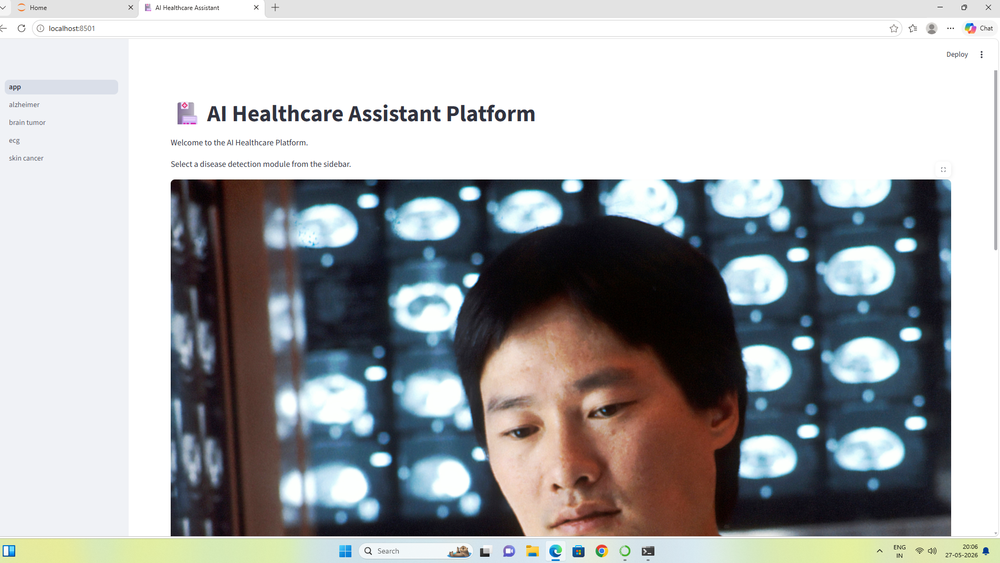
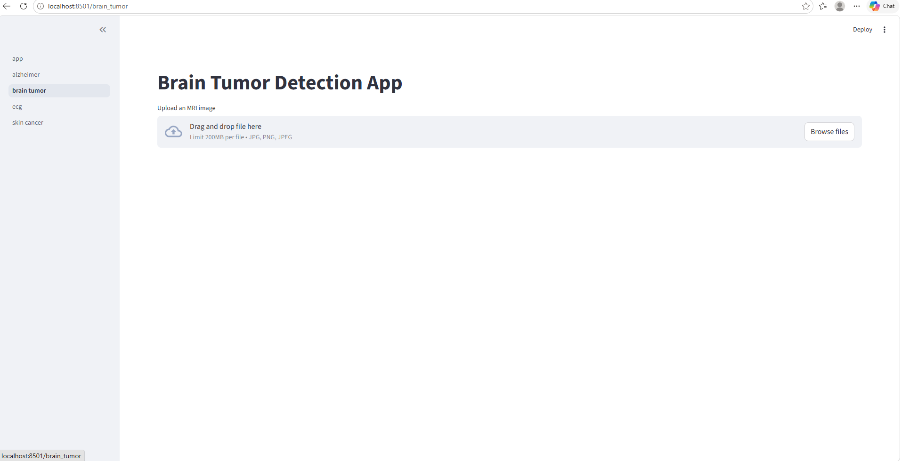
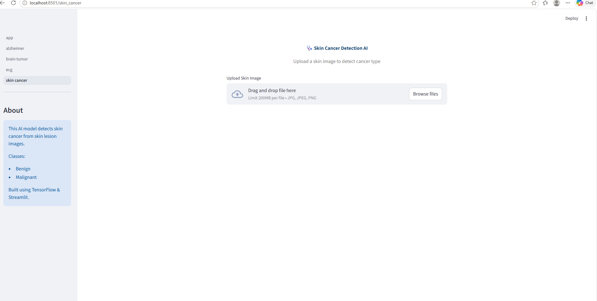
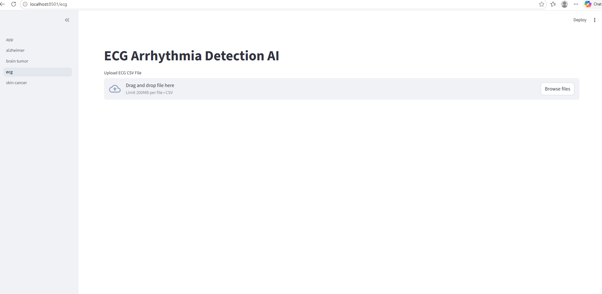
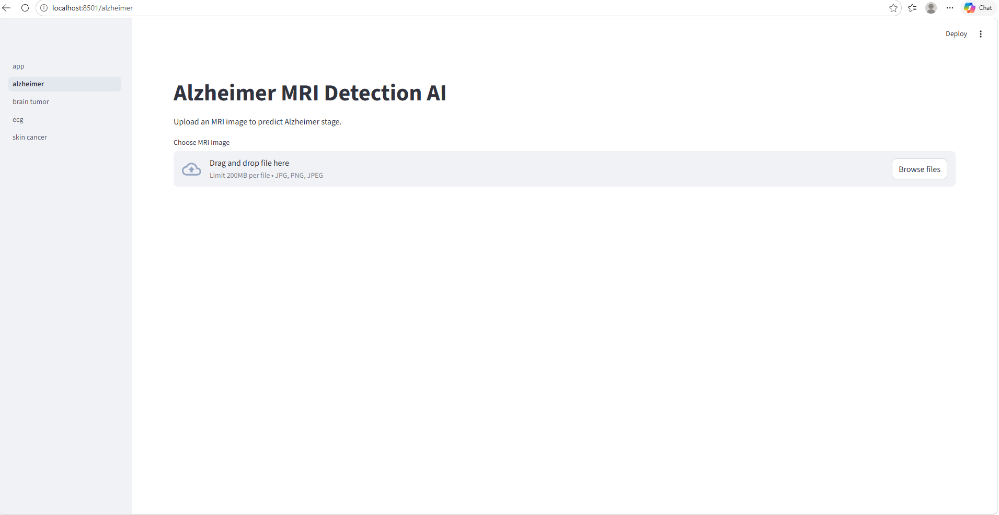

AI HEALTHCARE PLATFORM

Overview
AI Healthcare Platform is a multi-page medical AI web application developed using Python, TensorFlow, and Streamlit.

The platform integrates multiple healthcare disease detection systems into one centralized dashboard for medical image analysis and AI-assisted diagnois.

Features
- Brain Tumo-Detection
- Skin Canc- Detection
- ECG Arrhyth-a Detection
- Alzhe-er Detection
- Multi-page Stre-lit Dashboard
- AI Predictions with C-fidence Scores
- Medical Imae oad 

AI Technologies Used

- TensorFlow
- Keras
- CNN (Convolution Neural Networks)
- Streamlit
- NumPy
- Pillow (PIL)
- Python

Project Structure

ai-healthcare-platform/
│
├── app.py
├── models/
├── notebooks/
├── pages/
├── screenshots/
├── requirements.txt
├──README.md

Screenshots

 How To Run

1. Clone Repository

git clone https://github.com/shamurinkya/ai-healthcare-platform.git

2. Open Project Folder

cd ai-healthcare-platform

3. Install Requiremt
pip install -r requirements.txt

4. Run Streamlit-App

streamlit run -pp.py

 Future Improvements

1. Doctor Authentication S-stem
2. PDF Medical Reor
3. Cloud Development
4. Explainable AI (Grad-CAM)
5. Patient Database
6. DICOM Image Support

Disclaimer

This project is for educational and research purposes only and should not replace professional medical diagnosis.

Author

Shamuri H Nkya

B.Sc.Radiography with minor AI and Machine Learning in healthcare
